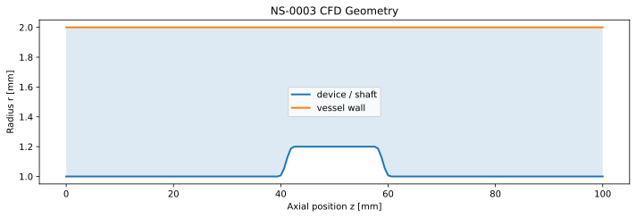
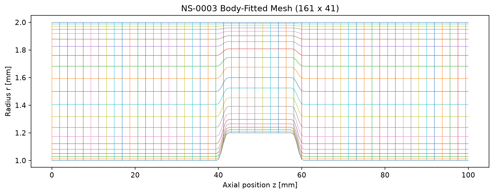
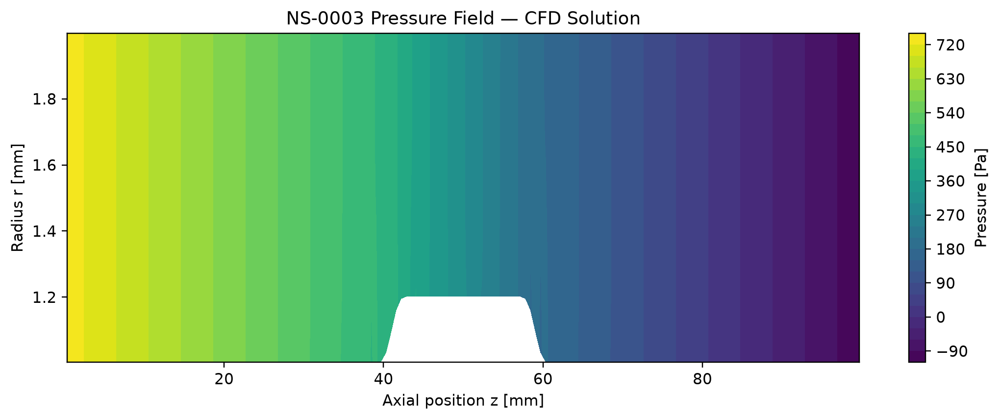
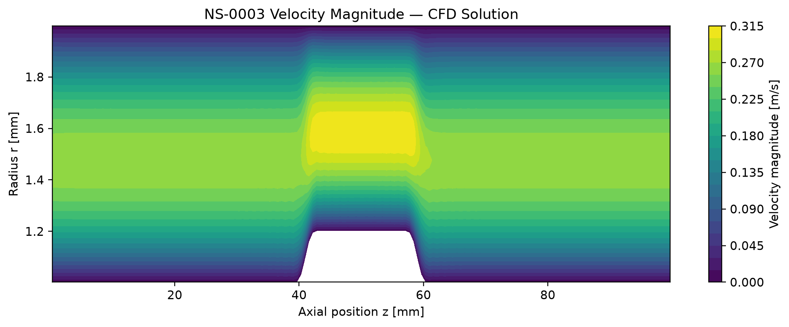

# Navier–Stokes AI · public CFD case study

A small, runnable verification example from a physics-grounded CFD and AI design project. It contains an analytical and numerical straight-annulus benchmark (NS–0001) and a frozen device-case field package (NS–0003). [Explore the interactive dashboard](https://navier-stokes-ai-verification.amir-yousef-sajjadi.chatgpt.site/#results) or [read the CFD report](https://navier-stokes-ai-verification.amir-yousef-sajjadi.chatgpt.site/report.html).

| Case | What you can reproduce here | Recorded result |
|---|---|---|
| NS–0001 · concentric annulus | Run the analytical model and iterative straight-annulus numerical solver, regenerate convergence and field plots, and test grid refinement | Analytical Δp = 736.92179 Pa; numerical Δp ≈ 737.04095 Pa |
| NS–0003 · device baseline | Load the frozen 161 × 41 body-fitted CFD field, recompute pressure drop and peak speed, and replot pressure and velocity profiles | Δp = 846.261543 Pa; peak speed = 0.31400296 m/s |

**Scope:** NS–0003 postprocessing is reproducible from the saved field array. Its production CFD solver is in a separate private research repository, so this public package does not rerun the device-case solve. No experiment, patient-specific anatomy, clinical validation, or medical safety claim is represented here. Wall shear is reported in the frozen summary and retains a mesh-sensitivity qualification.

## Run it

Use Python 3.12. The numerical library versions in `requirements.txt` are pinned.

```bash
python -m venv .venv
# Activate .venv with your shell's normal command.
python -m pip install -r requirements.txt
python -m unittest discover -s tests -v
python scripts/check_public_package.py
python scripts/run_ns0001.py
python scripts/check_ns0003_saved_fields.py --plot
```

`run_ns0001.py` generates `generated/NS-0001/verification.json`, `residual_history.csv`, and four plots. The saved-field command generates `generated/NS-0003/profiles.png`. Generated output is ignored by Git; recorded reference evidence lives under `evidence/`.

## Geometry, mesh, and solution

The NS–0003 geometry is a **continuous shaft with a local enlarged body**, not a free-ended catheter tip. The published case parameters are in [`case.json`](evidence/NS-0003/case.json). The vessel inner diameter is 4 mm; the shaft outer diameter is 2 mm; the body outer diameter is 2.4 mm. Flow is 100 mL/min in a steady Newtonian, rigid-wall, axisymmetric model.

| Geometry | Production mesh |
|---|---|
|  |  |

| Static pressure | Velocity magnitude |
|---|---|
|  |  |

Pressure drop is the difference between the arithmetic radial-cell mean pressures in the first and last axial cell rows. Peak speed is the maximum of `hypot(u_z,u_r)` across stored cells. [`check_ns0003_saved_fields.py`](scripts/check_ns0003_saved_fields.py) verifies both values against the frozen [`baseline_verification.json`](evidence/NS-0003/baseline_verification.json). Its plot uses the saved axial velocity values at the stored cross-section nearest 50 mm, without adding wall points.

## Verification and limits

- The NS–0001 analytical solution checks numerical pressure and velocity; its generated result package includes a 21/41/81/161 radial-grid sequence, mass conservation, no-slip walls, and residual gates. See the [pinned reference verification](evidence/NS-0001/verification.json).
- The NS–0003 baseline passed its recorded convergence and mass gates. On the three-grid study, medium-to-fine differences were 0.599% for pressure drop, 0.074% for peak speed, and **3.374% for device P95 wall shear**. The latter remains a numerical-quality qualification; this package does not claim universal mesh independence. See the [three-grid results](evidence/NS-0003/mesh_sensitivity.json).
- These checks establish numerical behavior for the declared model. External physical validation remains pending.

## Provenance and reuse

The source files, frozen JSON evidence, field archive, and NS–0003 figures were drawn from private source commit [`695403bf`](https://github.com/asajjadi/Navier-Stokes_AI/commit/695403bf71dcac1f884dcb1fd3ba786836fbecc7) on 23 September 2026. The NS–0001 runner's output location was adapted to `generated/`; its solver physics was not changed. Running it locally regenerates the four NS–0001 figures. The private source link requires collaborator access; everything needed to run the public checks is included here.

© 2026 Amir Sajjadi. Published for portfolio review; no reuse license is granted. Contact the author for permission to reuse the code or figures.
